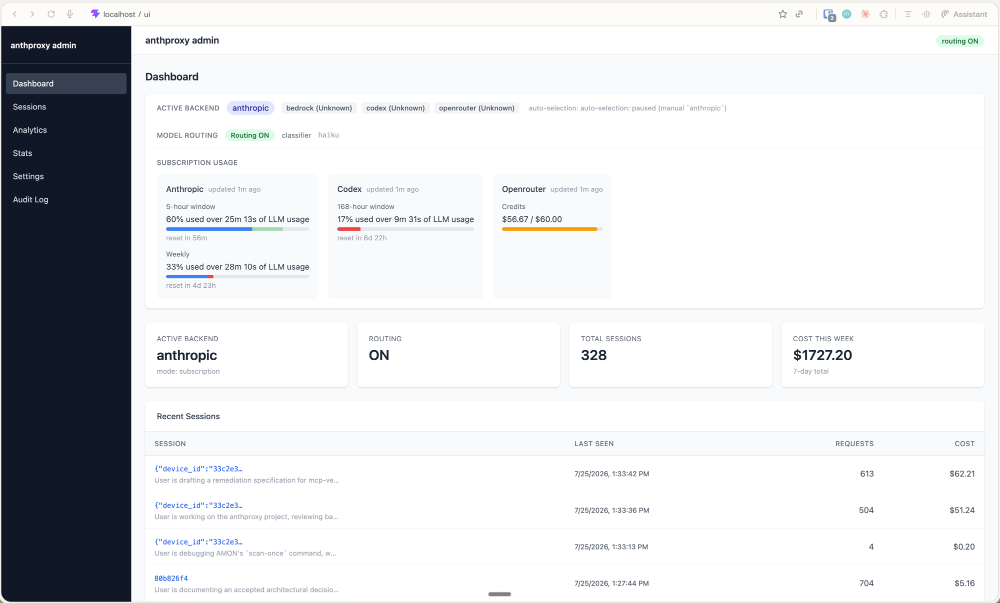

# anthproxy

A local HTTP proxy that translates Anthropic Messages API requests to multiple LLM backend APIs. Route between Bedrock, Codex, Anthropic, OpenRouter, and local LM Studio endpoints — all through a single Anthropic-compatible interface.

## Features

- **Backend routing** — Switch between Bedrock, Anthropic, Codex, OpenRouter, and local endpoints via simple proxy commands
- **Automatic backend selection** — Intelligently select backends based on subscription quota availability and configuration
- **Model-tier routing** — Route requests by task complexity using a lightweight classifier or deterministic rules
- **Admin UI** — Optional web interface for monitoring usage, routing status, and session management
- **Session pinning** — Override backend selection per-session (e.g., pin Claude Code to a specific backend)
- **Usage tracking** — Per-backend token counts, estimated costs, and subscription window visibility

## Quick start

Install and run:

```bash
pip install -e .
python -m anthproxy --port 8082
```

Send a message:

```bash
curl -X POST http://localhost:8082/v1/messages \
  -H "Content-Type: application/json" \
  -H "x-api-key: unused" \
  -d '{"model":"sonnet","max_tokens":100,"messages":[{"role":"user","content":"Hello"}]}'
```

Check status with a local proxy command:

```bash
curl -X POST http://localhost:8082/v1/messages \
  -H "Content-Type: application/json" \
  -d '{"model":"sonnet","max_tokens":100,"messages":[{"role":"user","content":"proxy-status"}]}'
```

## Supported backends

| Backend | Auth | Upstream |
|---------|------|----------|
| **Bedrock** | AWS credentials in `x-api-key` header | AWS Bedrock Converse API |
| **Anthropic** | OAuth (Claude subscription) | Anthropic Messages API |
| **Codex** | OAuth (ChatGPT account) | ChatGPT Codex via OpenAI Codex endpoint |
| **OpenRouter** | API key in config | OpenRouter's Anthropic-compatible gateway |
| **Local** | None | LM Studio or local Anthropic-compatible server |
| **Peer** | `X-Anthproxy-Peer-Key` from `--peer-api-key` (optional) | Another anthproxy instance via its `/v1/messages` |

## Configuration

### Environment & flags

```bash
anthproxy \
  --host 127.0.0.1 \                           # Bind address (default)
  --port 8082 \                                 # Bind port (default)
  --backend bedrock \                           # Default backend (default)
  --backends anthropic,codex \                  # Restrict discoverable backends (default: all)
  --region us-east-1 \                          # AWS region for Bedrock
  --auto-backend \                              # Enable automatic selection (default)
  --auto-backend-mode subscription \            # Start mode: subscription | auto
  --enable-ui \                                 # Enable admin UI + session DB (default: off)
  --log-level INFO                              # Log level (default)
```

See `python -m anthproxy --help` for the full option list.

`--backends` (env: `ANTHPROXY_BACKENDS`) takes a comma-separated allowlist restricting
which backends are discoverable/selectable at all — via `--backend`, `/backend` local
commands, the admin UI, and auto-backend rotation. Omit it to leave every installed
backend available (the default) — except `peer`, which is enabled by `--peer-base-url`
rather than by installation, and must still be listed explicitly when `--backends` is
passed. An unknown name or an empty list is a startup error.
`--backend`'s own default is silently repaired to the first enabled backend when the
allowlist excludes it; an *explicit* `--backend` outside the allowlist is a startup
error naming both flags.

### Authentication

**Bedrock:** AWS access key + secret in `x-api-key` header (base64-encoded):
```
base64(access_key_id|secret_access_key|session_token)
```

**Anthropic & Codex:** OAuth (interactive browser login on first run, then automatic refresh):
```bash
python -m anthproxy --backend anthropic  # Opens browser for Claude subscription OAuth
python -m anthropproxy --backend codex   # Opens browser for ChatGPT OAuth
```

**OpenRouter:** Set `OPENROUTER_API_KEY` environment variable or `--openrouter-api-key` flag.

**Local:** No auth required.

## Endpoints

### POST /v1/messages

Standard Anthropic Messages API (streaming and non-streaming).

```bash
# Non-streaming
curl -X POST http://localhost:8082/v1/messages \
  -H "Content-Type: application/json" \
  -H "x-api-key: $API_KEY" \
  -d '{
    "model": "sonnet",
    "max_tokens": 100,
    "messages": [{"role": "user", "content": "Hello"}]
  }'

# Streaming
curl -X POST http://localhost:8082/v1/messages \
  -H "Content-Type: application/json" \
  -H "x-api-key: $API_KEY" \
  -d '{
    "model": "sonnet",
    "max_tokens": 100,
    "stream": true,
    "messages": [{"role": "user", "content": "Hello"}]
  }'
```

### POST /v1/messages/count_tokens

Count input tokens for a request.

```bash
curl -X POST http://localhost:8082/v1/messages/count_tokens \
  -H "Content-Type: application/json" \
  -H "x-api-key: $API_KEY" \
  -d '{
    "model": "sonnet",
    "messages": [{"role": "user", "content": "Hello"}]
  }'
```

## Local proxy commands

Send these as the entire text of the final user message to control the proxy locally (never reach the LLM):

| Command | Effect |
|---------|--------|
| `proxy-help` | List all available commands |
| `proxy-status` | Show active backend + subscription usage |
| `proxy-get-backend` | Report active backend (shows session override if set) |
| `proxy-set-backend:bedrock` | Switch to Bedrock (global) |
| `proxy-set-backend:codex` | Switch to Codex (global) |
| `proxy-set-backend:anthropic` | Switch to Anthropic (global) |
| `proxy-set-backend:openrouter` | Switch to OpenRouter (global, requires `OPENROUTER_API_KEY`) |
| `proxy-set-backend:local` | Switch to Local (LM Studio, pinned, never auto-selected) |
| `proxy-set-backend:auto` | Resume automatic backend selection |
| `proxy-set-backend:subscription` | Auto-select subscription backends only (Anthropic/Codex/OpenRouter) |
| `proxy-set-backend:<name>:session` | Pin backend for this session only |
| `proxy-set-backend:auto:session` | Clear session backend pin |
| `proxy-stats` | Show today's token usage grouped by hour |
| `proxy-stats:-1d` | Show yesterday |
| `proxy-stats:1w` | Show this week grouped by day |
| `proxy-stats:<period>:<backend>` | Filter stats to one backend (e.g., `proxy-stats:1d:bedrock`) |
| `proxy-get-usage` | Fetch subscription windows from upstream API |

Example:

```bash
curl -X POST http://localhost:8082/v1/messages \
  -H "Content-Type: application/json" \
  -d '{"model":"sonnet","max_tokens":100,"messages":[{"role":"user","content":"proxy-status"}]}'
```

## Model tier routing

When `--auto-model-routing` is enabled, requests are routed by complexity to different model tiers (Haiku for simple tasks, Sonnet for standard, Opus for deep work).

Routing modes:
- **classifier** (default) — Lightweight LLM call classifies the request into `trivial`, `standard`, or `deep`
- **rules** — Deterministic keyword-based routing
- **tag** — Use a task name supplied by `X-Anthproxy-Override: task:<name>` header

Long-context requests (> 150k tokens by default) are always routed to Opus with a 1-minute thinking context.

Override globally with `proxy-set-model-routing:on` / `proxy-set-model-routing:off`, or per-session with `:session` suffix.

Use `X-Anthproxy-Override: no-classifier` to bypass routing for a single request.

## Admin UI

Enable the optional web UI with `--enable-ui`. It exposes:
- Session tracking (request history, model usage, latency)
- Routing status and per-backend statistics
- Backend and model-routing controls

The UI is unauthenticated and should only be bound to localhost (`127.0.0.1`) or protected by external access control.

```bash
python -m anthproxy --enable-ui --port 8082
# Then open http://127.0.0.1:8082/ui/ in your browser
```



## Development

Install dev dependencies:

```bash
uv sync --dev
```

Run tests:

```bash
uv run python -m pytest tests/ -v
```

Run linter and type checks:

```bash
uv run python -m ruff check .
```

For the React admin UI:

```bash
cd anthproxy/ui
npm ci
npm run dev          # Development server (live reload)
npm run build        # Production bundle
```

The UI's production bundle (`anthproxy/ui/dist/`) is checked in; rebuild and commit it when UI source changes.

## Model aliases

Short names like `sonnet`, `opus`, `haiku` map to backend-specific model IDs automatically.

| Alias | Bedrock | Codex | Anthropic | OpenRouter |
|-------|---------|-------|-----------|------------|
| `opus` | claude-opus-4-... | gpt-5.5 | claude-opus-4-8 | claude-opus-4-8 |
| `sonnet` | claude-sonnet-4-... | gpt-5.4 | claude-sonnet-4-6 | claude-sonnet-4-6 |
| `haiku` | claude-haiku-4-... | gpt-5.4-mini | claude-haiku-4-5-... | claude-haiku-4-5-... |

You can also use full Anthropic model names (e.g., `claude-sonnet-4-6`) or native backend IDs (e.g., `anthropic.claude-sonnet-4-6` for Bedrock).

## License

MIT License. See LICENSE.txt for details.
